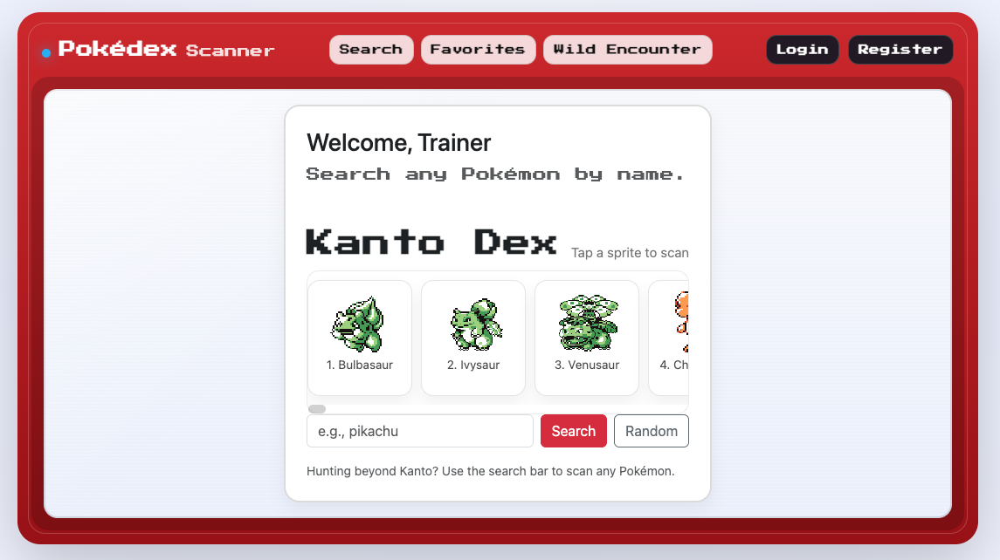
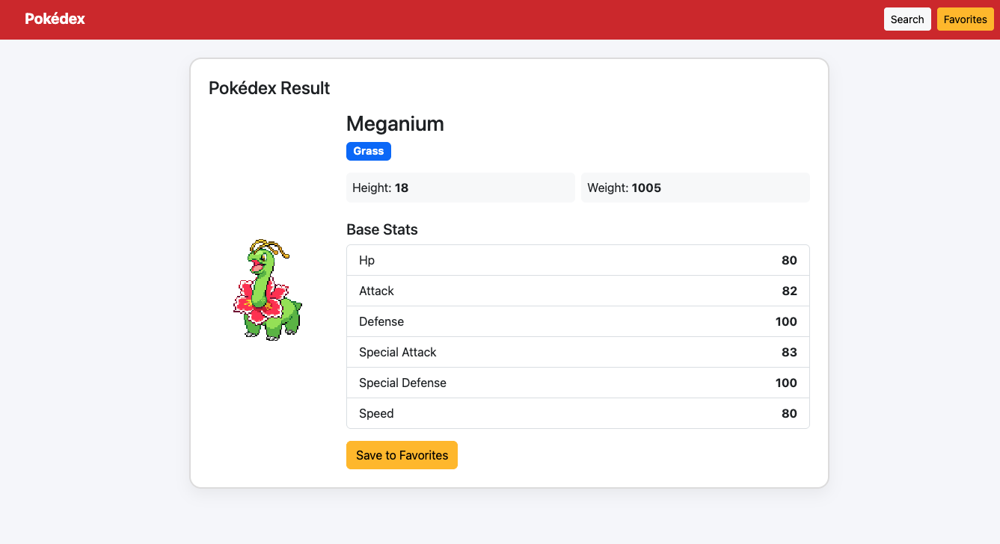
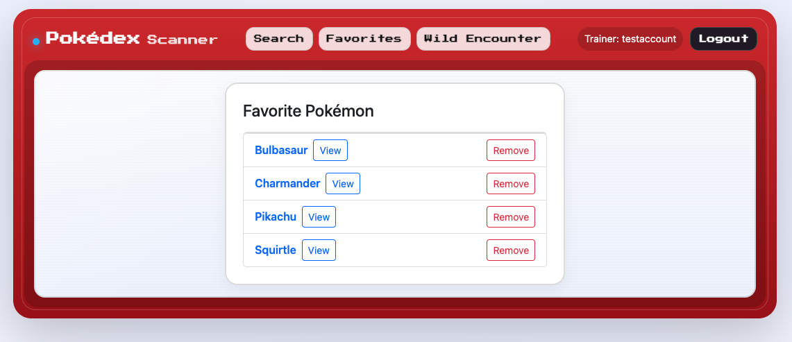

# Pokédex (Flask)

In celebration of Pokémon's 30th Anniversary, I have built a simple Pokédex web app built with **Python + Flask** that lets you search for a Pokémon, view details from the **PokéAPI**, and save favorites using **SQLite**.

## Features
- Search Pokémon by name
- View sprite, types, and base stats
- Save and remove favorites (housed in SQLite)
- Responsive styling with Bootstrap

## Screenshots




## Tech Stack
- Python
- Flask (Jinja2 templates)
- Requests (HTTP)
- SQLite
- Bootstrap 5

## Getting Started

### 1) Clone repo & create virtual environment
```bash
git clone https://github.com/akonisanchez/pokedex.git
cd pokedex
python3 -m venv venv
source venv/bin/activate
```

### 2) Install dependencies
```bash
pip install flask requests
```

### 3) Run the app
```bash
python3 app.py
```