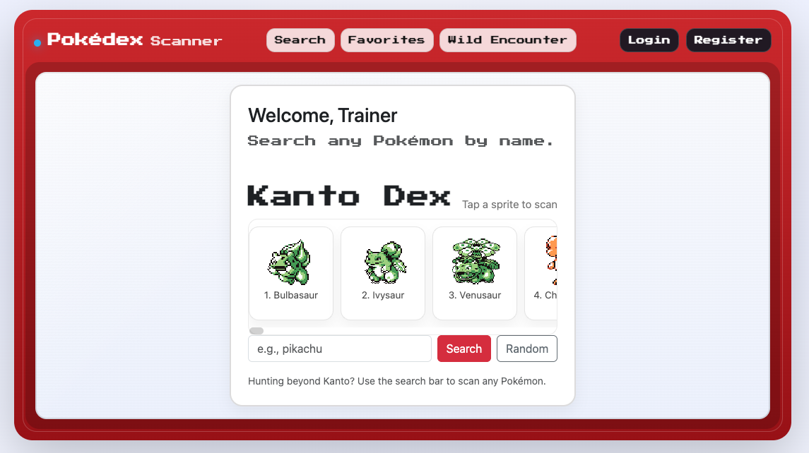
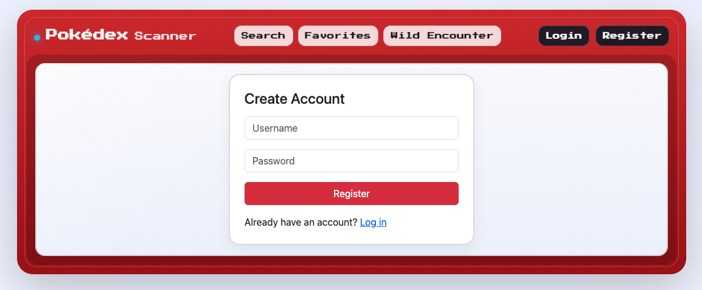
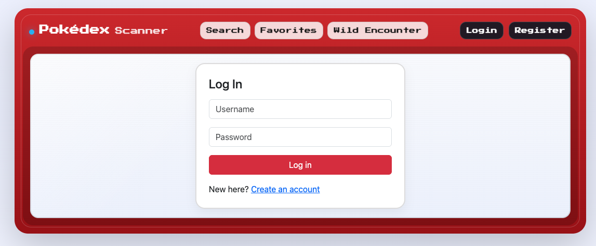
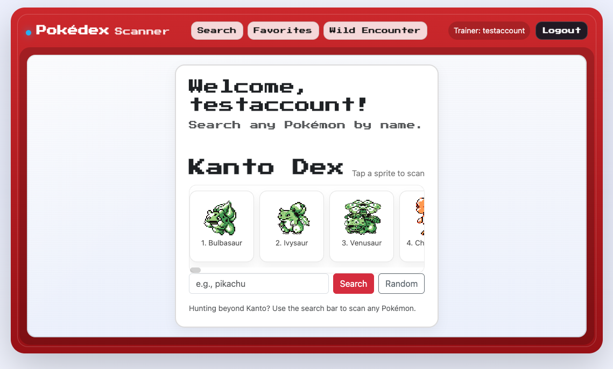
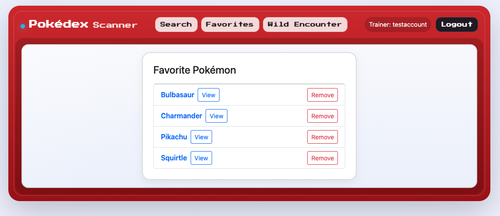
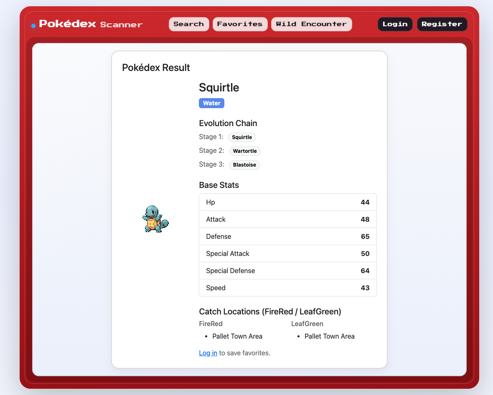

# Pokédex Scanner

A Flask web app built in celebration of Pokémon’s 30th anniversary. It started as a way to practice building a real web product around an external API, then turned into a practical companion for my Pokémon LeafGreen run so I could quickly scan a Pokémon and see key details, evolution stages, and where it can be found in game to make team planning a bit easier.

**Live Demo:** https://pokedex-scanner.onrender.com/
Note: the first load can take a minute if the service is waking up.

### ▶ Walkthrough video
[](https://youtu.be/CCI_VVFnKNE)

## Persistence Note (Demo)
This app uses SQLite for simplicity. On deployed demo, data (i.e., accounts/favorites) may reset after a redeploy or server restart.

## Features

* Scan any Pokémon by name using PokéAPI data
* Kanto Dex sprite scroller with classic Gen 1 Red and Blue sprites
* Wild Encounter button for quick random scans
* Evolution chain shown as stage rows, including branching lines
* FireRed and LeafGreen wild encounter locations when available
* Accounts with register, login, and logout
* Per user favorites with add and remove flows

## Demo Screenshots

**Home**


**Register**


**Login**


**Logged in user state**


**Favorites**


**Pokemon search results**



## Tech Stack

* Python
* Flask with Jinja templates
* Requests for HTTP
* SQLite for persistence
* Bootstrap 5 plus custom CSS device shell
* pytest unit tests

## What I learned

* How to design and ship a full stack feature from UI to database, including auth and per user data
* How to work with external APIs reliably, including timeouts, caching, and performance tradeoffs
* How to structure iterative improvements through small PRs and clean commits
* How to polish UX through responsive styling and a consistent visual system

## Getting Started

### 1) Clone repo & create virtual environment
```bash
git clone https://github.com/akonisanchez/pokedex.git
cd pokedex
python3 -m venv venv
source venv/bin/activate
```

### 2) Install dependencies
```bash
pip install -r requirements.txt
```

### 3) Run the app
```bash
python3 app.py
```